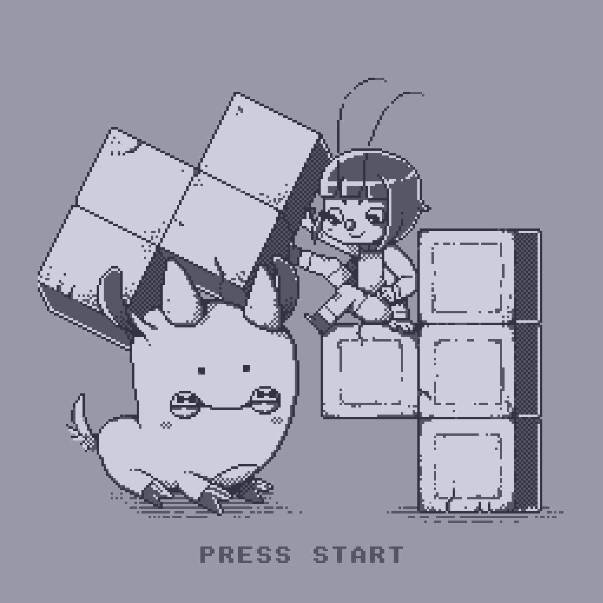
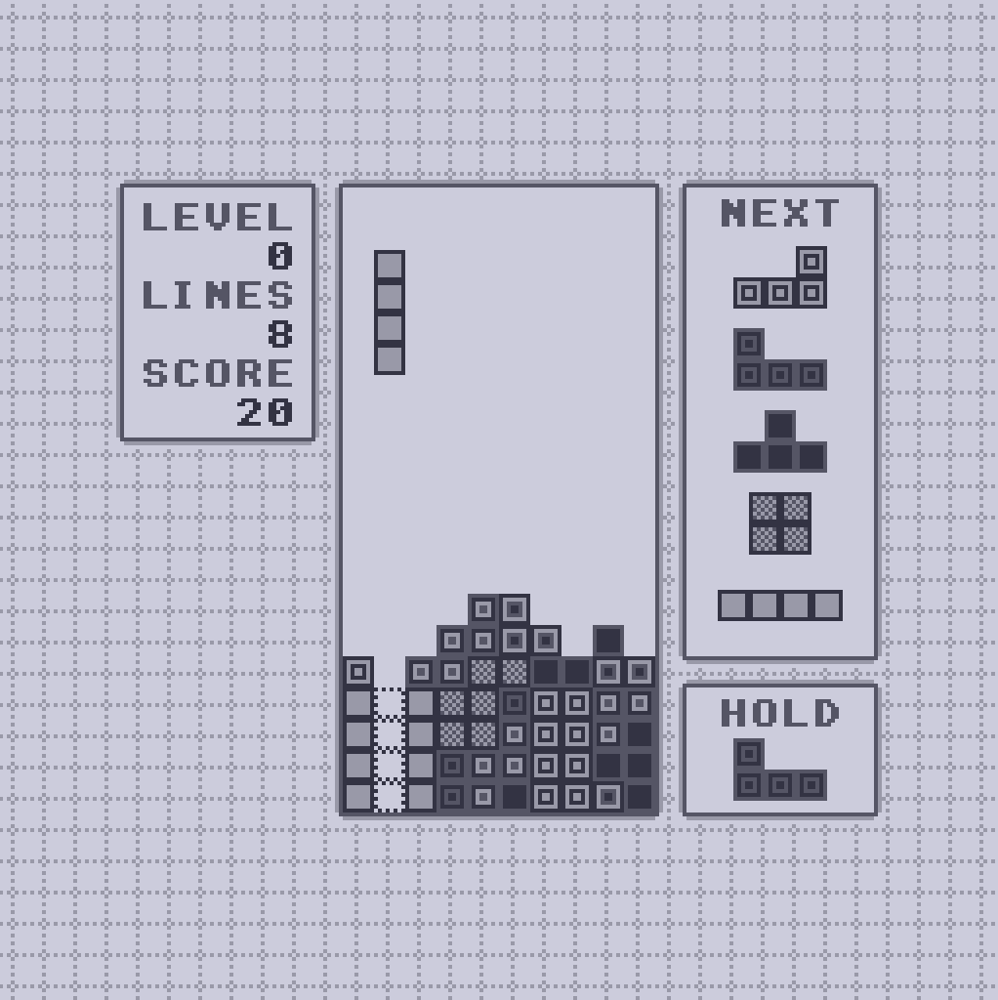

# fourtette

A block game by [nf](mailto:nf@wh3rd.net) for [Uxn](https://100r.co/site/uxn.html).

Title screen by [Rek Bell](http://kokorobot.ca/site/home.html).

Music arranged by [d_m](http://plastic-idolatry.com/erik).

## Controls:

```
  [A]/[B]  rotate left/right
  [L]/[R]  move left/right
  [Up]     drop
  [Down]   fast fall
  [Select] swap hold piece
  [Start]  pause
```

## Screenshots

 

## Technical notes:

The playable well is 10 columns by 40 rows, as per the guideline. It is stored
in a x10 by x30 region of memory starting at @well. Each row is x10 bytes, with
the playable well in columns (x03, x0c), so the three bytes at the start and
end of each line are not usable and form the walls.

The high nibble of each well byte indicates the block state (for gameplay
purposes), the low nibble indicates the block type (for drawing purposes).

```
 [ 8 4 2 1 8 4 2 1 ]
   | | | | |  \|/
   | | | | |   type (0-6 normal pieces, 7 ghost)
   | | | | unused
   | | | falling  - set by set-cur-piece
   | | frozen     - set by freeze-cur-piece
   | compacting   - set and cleared by compact-well
   wall/bottom    - set by init-well
```

## Gratitude

Special thanks to [Devine Lu Linvega](https://xxiivv.com/) for creating Uxn and
their guidance and encouragement throughout the development of fourtette and
[nux](https://github.com/nf/nux).

Thanks also to the people of #uxn for their help, feedback, and enthusiasm.
